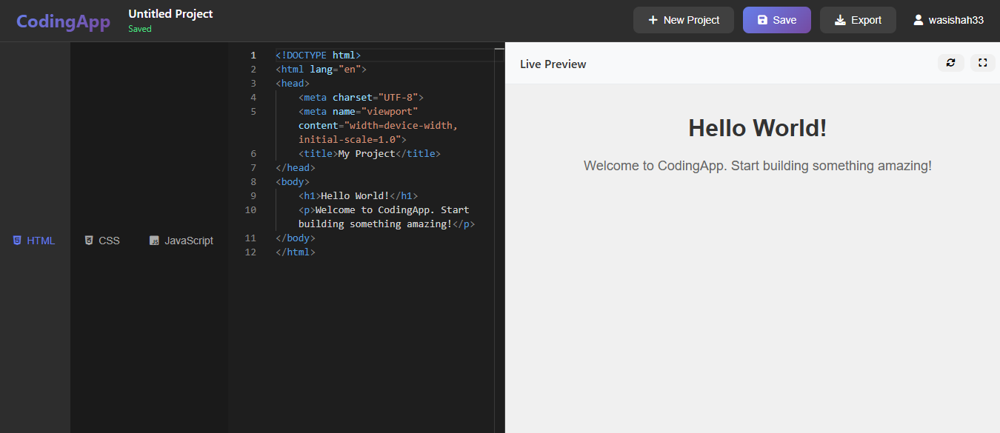

# CodingApp - Live Code Editor

<div align="center">
  
</div>

[](https://nodejs.org/)
[](https://expressjs.com/)
[](https://developer.mozilla.org/en-US/docs/Web/JavaScript)
[](https://developer.mozilla.org/en-US/docs/Web/HTML)
[](https://developer.mozilla.org/en-US/docs/Web/CSS)
[](https://www.php.net/)
[](https://www.sqlite.org/)
[](https://microsoft.github.io/monaco-editor/)
[](https://opensource.org/licenses/MIT)

A modern, web-based code editor with live preview functionality. Built with Node.js, Express, and Monaco Editor for a professional coding experience.

## Features

### ✨ Core Features
- **Live Code Editor**: Write HTML, CSS, JavaScript, and PHP with syntax highlighting
- **Real-time Preview**: See your changes instantly in the preview window
- **PHP Execution**: Server-side PHP code execution with live preview
- **Project Management**: Save, load, and organize your coding projects
- **User Authentication**: Secure login/registration system
- **Export Functionality**: Download your projects as HTML files
- **Auto-save**: Automatic saving to prevent data loss

### 🎨 User Interface
- **Modern Dark Theme**: Professional VS Code-like interface
- **Responsive Design**: Works on desktop and mobile devices
- **Tabbed Editor**: Switch between HTML, CSS, JavaScript, and PHP
- **Project Sidebar**: Easy access to all your saved projects
- **Fullscreen Preview**: Expand preview for better viewing

### 🔧 Technical Features
- **Monaco Editor**: Same editor used in VS Code
- **SQLite Database**: Lightweight, file-based data storage
- **JWT Authentication**: Secure token-based authentication
- **RESTful API**: Clean, well-structured backend API
- **CORS Enabled**: Cross-origin resource sharing support

## Prerequisites

Before running this application, make sure you have:

- **Node.js** (version 14 or higher)
- **npm** (comes with Node.js)
- **PHP** (version 7.4 or higher) - Required for PHP code execution

## Installation

1. **Clone or download the project**
   ```bash
   git clone <repository-url>
   cd codingapp
   ```

2. **Install dependencies**
   ```bash
   npm install
   ```

3. **Start the server**
   ```bash
   npm start
   ```

4. **Open your browser**
   Navigate to `http://localhost:3000`

## Development

To run the application in development mode with auto-restart:

```bash
npm run dev
```

## Project Structure

```
codingapp/
├── public/                 # Frontend files
│   ├── index.html         # Main HTML file
│   ├── styles.css         # CSS styles
│   └── app.js            # Frontend JavaScript
├── server.js              # Express server
├── package.json           # Dependencies and scripts
├── codingapp.db          # SQLite database (created automatically)
└── README.md             # This file
```

## API Endpoints

### Authentication
- `POST /api/register` - Register a new user
- `POST /api/login` - Login user

### Projects
- `GET /api/projects` - Get all user projects
- `GET /api/projects/:id` - Get specific project
- `POST /api/projects` - Create new project
- `PUT /api/projects/:id` - Update project
- `DELETE /api/projects/:id` - Delete project
- `GET /api/projects/:id/export` - Export project as HTML

### PHP Execution
- `POST /api/execute-php` - Execute PHP code and return HTML output

## Usage Guide

### Getting Started

1. **Register/Login**: Create an account or login with existing credentials
2. **Create Project**: Click "New Project" to start coding
3. **Write Code**: Use the tabbed editor to write HTML, CSS, JavaScript, and PHP
4. **Live Preview**: See your changes instantly in the preview panel
5. **Save Project**: Click "Save" to store your project (auto-save also available)
6. **Export**: Download your project as an HTML file

### Editor Features

- **Syntax Highlighting**: Automatic highlighting for HTML, CSS, JavaScript, and PHP
- **Auto-completion**: Intelligent code suggestions
- **Error Detection**: Real-time error highlighting
- **Line Numbers**: Easy navigation with line numbers
- **Word Wrap**: Automatic text wrapping for better readability

### PHP Development

- **Server-side Execution**: PHP code runs on the server and displays output in preview
- **Error Handling**: PHP errors are displayed in the preview window
- **HTML Integration**: PHP code can be mixed with HTML, CSS, and JavaScript
- **Real-time Preview**: See PHP output immediately as you type
- **Security**: PHP execution is sandboxed and has timeout protection

### Project Management

- **Save Projects**: Projects are automatically saved to your account
- **Load Projects**: Access all your projects from the sidebar
- **Project List**: View all projects with last modified dates
- **Delete Projects**: Remove projects you no longer need

## Configuration

### Environment Variables

You can configure the application using environment variables:

```bash
PORT=3000                    # Server port (default: 3000)
JWT_SECRET=your-secret-key   # JWT secret for authentication
```

### Database

The application uses SQLite for data storage. The database file (`codingapp.db`) is created automatically when you first run the application.

## Security Features

- **Password Hashing**: Passwords are hashed using bcrypt
- **JWT Tokens**: Secure authentication tokens
- **Input Validation**: Server-side validation for all inputs
- **SQL Injection Protection**: Parameterized queries
- **CORS Protection**: Configured for security

## Browser Support

- Chrome (recommended)
- Firefox
- Safari
- Edge

## Troubleshooting

### Common Issues

1. **Port already in use**
   ```bash
   # Change the port in server.js or use a different port
   PORT=3001 npm start
   ```

2. **Database errors**
   ```bash
   # Delete the database file and restart
   rm codingapp.db
   npm start
   ```

3. **Monaco Editor not loading**
   - Check your internet connection
   - Ensure CDN is accessible
   - Try refreshing the page

4. **PHP execution not working**
   - Ensure PHP is installed and accessible from command line
   - Check if `php` command is in your system PATH
   - Verify PHP version is 7.4 or higher
   - Check server logs for PHP execution errors

### Performance Tips

- Close unused browser tabs
- Use modern browsers for best performance
- Large projects may take longer to load

## Contributing

1. Fork the repository
2. Create a feature branch
3. Make your changes
4. Test thoroughly
5. Submit a pull request

## License

This project is licensed under the MIT License.

## Support

If you encounter any issues or have questions:

1. Check the troubleshooting section
2. Review the browser console for errors
3. Ensure all dependencies are installed
4. Verify your Node.js version

## Future Enhancements

- [ ] Support for more programming languages
- [ ] Collaborative editing
- [ ] Version control integration
- [ ] Custom themes
- [ ] Plugin system
- [ ] Cloud storage integration
- [ ] Real-time collaboration
- [ ] Advanced debugging tools

---

**Happy Coding! 🚀**
